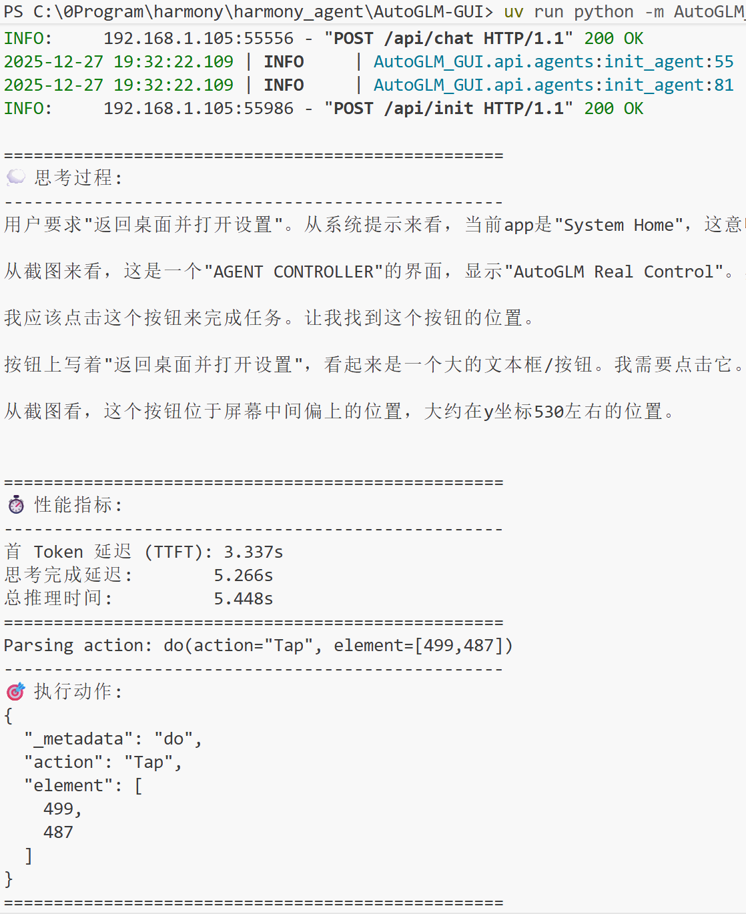

# AutoGLM-GUI

**完全可控的本地手机智能体后端服务**

AutoGLM-GUI 是 Harmony Agent 项目的 PC 端后端服务，提供手机智能体的核心控制逻辑。通过封装设备控制能力（HDC/ADB）和大模型推理服务，实现对手机的自动化操作。

## 项目特性

### 本地化与隐私保护
- **本地大模型支持**：支持 vLLM、llama.cpp 等本地大模型服务，数据不外泄
- **OpenAI 兼容接口**：既可使用本地服务，也支持云端 API
- **完全可审计**：开源代码，所有操作流程透明可见

### 多平台设备支持
- **HarmonyOS**：通过 HDC 完整支持鸿蒙系统
- **Android**：通过 ADB 支持安卓设备
- **统一抽象**：DeviceFactory 设计模式，易于扩展新平台

### 智能体核心能力
- **屏幕理解**：自动截图并通过视觉模型分析当前界面
- **智能决策**：基于大模型的自然语言任务理解和操作规划
- **精确执行**：支持点击、滑动、输入、启动应用等完整操作集

### REST API 服务
- **FastAPI 框架**：高性能异步 API 服务
- **Socket.IO 支持**：实时视频流传输（可选）
- **标准化接口**：便于前端集成和第三方调用

## 系统架构


核心组件说明：
- **API 服务层**：提供 REST API 接口，处理前端请求
- **PhoneAgent**：智能体核心，实现"感知-决策-执行"闭环
- **DeviceFactory**：设备适配层，抽象不同平台的控制接口
- **ModelClient**：大模型客户端，支持 OpenAI 兼容 API

## 快速开始

### 环境要求

- Python 3.10+
- Windows 10/11、macOS 或 Linux
- HDC 工具（用于 HarmonyOS 设备）或 ADB（用于 Android 设备）
- 大模型服务（本地或云端）

### 安装

1. **克隆项目**
```bash
git clone <repository-url>
cd harmony_agent/AutoGLM-GUI
```

2. **安装依赖**

使用 uv（推荐）：
```bash
uv sync
```

或使用 pip：
```bash
pip install -e .
```

### 准备大模型服务

**方案一：本地部署（推荐）**

**方案二：使用云端服务**

配置环境变量：
```bash
export OPENAI_API_KEY="your-api-key"
export OPENAI_BASE_URL="https://api.openai.com/v1"
```


### 连接设备

**HarmonyOS 设备**：
1. 开启开发者模式（设置 → 关于手机 → 连续点击版本号 7 次）
2. 开启 USB 调试（系统和更新 → 开发人员选项 → USB 调试）
3. 连接设备并授权
4. 验证连接：
```bash
hdc list targets
```

**Android 设备**：
```bash
adb devices
```

### 启动服务

```bash
uv run python -m AutoGLM_GUI --host 0.0.0.0 --port 7860
```

服务启动后会显示：
- REST API 地址：`http://0.0.0.0:7860`
- API 文档：`http://0.0.0.0:7860/docs`

## 任务执行流程


核心执行步骤：
1. **接收任务**：通过 `/api/chat` 接口接收自然语言任务
2. **创建智能体**：初始化 PhoneAgent 实例
3. **循环执行**：
   - 截取屏幕
   - 调用大模型分析并决策
   - 执行操作（点击/滑动/输入等）
   - 判断任务是否完成
4. **返回结果**：返回执行结果和步骤数



## API 文档

### 初始化智能体

**POST** `/api/init`

请求体：
```json
{
  "device_id": "FMR0223C13000649",
  "device_type": "hdc",
  "model_name": "qwen-vl-max",
  "api_base": "http://localhost:8000/v1",
  "api_key": "EMPTY"
}
```

响应：
```json
{
  "session_id": "550e8400-e29b-41d4-a716-446655440000",
  "status": "initialized"
}
```

### 执行任务

**POST** `/api/chat`

请求体：
```json
{
  "session_id": "550e8400-e29b-41d4-a716-446655440000",
  "user_input": "打开设置，开启蓝牙"
}
```

响应：
```json
{
  "result": "任务完成：已成功开启蓝牙",
  "steps": 5,
  "session_id": "550e8400-e29b-41d4-a716-446655440000"
}
```

完整 API 文档请访问：`http://localhost:7860/docs`

## 目录结构

```
AutoGLM-GUI/
├── AutoGLM_GUI/           # 后端服务主模块
│   ├── api/               # REST API 路由
│   │   ├── agents.py      # 智能体管理接口
│   │   ├── devices.py     # 设备管理接口
│   │   └── control.py     # 设备控制接口
│   ├── socketio_server.py # Socket.IO 服务
│   ├── state.py           # 运行时状态管理
│   └── server.py          # ASGI 应用入口
├── phone_agent/           # 智能体核心模块
│   ├── agent.py           # PhoneAgent 主逻辑
│   ├── actions/           # 动作执行器
│   │   └── handler.py     # 点击/滑动/输入等操作
│   ├── model/             # 模型客户端
│   │   └── client.py      # OpenAI 兼容接口
│   ├── device_factory.py  # 设备抽象工厂
│   ├── hdc/               # HarmonyOS 设备适配
│   │   ├── screenshot.py  # 截图功能
│   │   ├── input.py       # 输入控制
│   │   └── control.py     # 设备控制
│   └── adb/               # Android 设备适配
└── pyproject.toml         # 项目配置文件
```

## 核心模块说明

### PhoneAgent（智能体核心）

`PhoneAgent` 实现了"感知-决策-执行"的完整闭环：

```python
class PhoneAgent:
    def run(self, task: str) -> dict:
        """执行任务的主循环"""
        while not self.is_finished:
            # 1. 感知：截取屏幕
            screenshot = self.device.get_screenshot()

            # 2. 决策：调用大模型
            action = self.model_client.decide(task, screenshot)

            # 3. 执行：执行操作
            self.action_handler.execute(action)

            # 4. 判断是否完成
            if action.type == "finish":
                self.is_finished = True
```

### DeviceFactory（设备适配层）

通过工厂模式抽象不同平台的设备控制能力：

```python
class DeviceFactory:
    def get_screenshot(device_id: str) -> Screenshot
    def tap(device_id: str, x: int, y: int) -> bool
    def swipe(device_id: str, x1, y1, x2, y2) -> bool
    def type_text(device_id: str, text: str) -> bool
    def launch_app(device_id: str, package: str) -> bool
```

### ModelClient（大模型客户端）

支持 OpenAI 兼容接口，既可使用本地服务也可使用云端 API：

- 自动处理多模态消息（文本 + 图像）
- 解析模型返回的操作指令
- 支持函数调用和结构化输出

## 配置说明

### 环境变量

```bash
# 大模型配置
OPENAI_API_KEY=your-api-key
OPENAI_BASE_URL=http://localhost:8000/v1
MODEL_NAME=qwen-vl-max

# 服务配置
HOST=0.0.0.0
PORT=7860
```

### 设备配置

支持的设备类型：
- `hdc`：HarmonyOS 设备
- `adb`：Android 设备

## 开发指南

### 添加新的设备平台

1. 在 `phone_agent/` 下创建新的设备适配模块
2. 实现以下接口：
   - `get_screenshot()`
   - `tap()`
   - `swipe()`
   - `type_text()`
   - `launch_app()`
3. 在 `device_factory.py` 中注册新平台

### 自定义操作类型

在 `phone_agent/actions/handler.py` 中添加新的 Action 类型：

```python
class CustomAction(Action):
    def execute(self, device_id: str) -> bool:
        # 实现自定义操作
        pass
```

## 运行效果


## 技术栈

- **Web 框架**：FastAPI
- **异步运行时**：asyncio
- **HTTP 客户端**：httpx
- **设备控制**：subprocess (HDC/ADB)
- **图像处理**：Pillow
- **类型检查**：Pydantic

## 安全考量

- **本地优先**：推荐使用本地大模型，数据不外泄
- **权限控制**：所有设备操作需要明确授权
- **敏感信息保护**：支付等敏感界面会被自动识别并跳过
- **代码审计**：完全开源，用户可审查所有代码逻辑

## 相关项目

- [Agent (HarmonyOS App)](../Agent/) - 鸿蒙端前端应用
